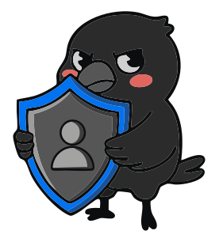

<p align="center">
  
</p>

<h1 align="center">Guard</h1>

<p align="center">
  A production-ready, multi-tenant Central Authentication Service (CAS)
</p>

A comprehensive Go client for Corvus Guard with full feature parity with the TypeScript SDK.

## Features

- ✅ **Core Authentication**: Password login/signup, magic links, MFA, email discovery
- ✅ **Tenant Management**: Create, read, and list tenants
- ✅ **Admin User Management**: List, update, block/unblock users
- ✅ **RBAC v2**: Full role-based access control with permissions
- ✅ **FGA**: Fine-grained authorization with groups and ACL tuples
- ✅ **SSO Provider Management**: Native OIDC/SAML provider configuration
- ✅ **Cookie Mode**: Support for both bearer token and cookie-based authentication
- ✅ **Session Management**: List and revoke user sessions
- ✅ **MFA Support**: TOTP and backup codes
- ✅ **OAuth2 BFF**: Server-side Authorization Code + PKCE exchange and refresh helpers

## Installation

```bash
go get github.com/corvusHold/guard/sdk/go
```

## Quick Start

### Bearer Mode (Default)

```go
package main

import (
    "context"
    "fmt"
    "log"

    guard "github.com/corvusHold/guard/sdk/go"
)

func main() {
    // Create client with bearer authentication
    client, err := guard.NewGuardClient(
        "https://your-guard-api.com",
        guard.WithTenantID("your-tenant-id"),
        guard.WithAuthMode(guard.AuthModeBearer), // default
    )
    if err != nil {
        log.Fatal(err)
    }

    // Login with password
    tokens, _, err := client.PasswordLogin(context.Background(), guard.ControllerLoginReq{
        Email:    "user@example.com",
        Password: "secure-password",
    })
    if err != nil {
        log.Fatal(err)
    }

    fmt.Printf("Access token: %s\n", *tokens.AccessToken)

    // Get current user profile
    profile, err := client.Me(context.Background())
    if err != nil {
        log.Fatal(err)
    }

    fmt.Printf("User: %s (%s)\n", *profile.Email, *profile.Id)
}
```

### Cookie Mode

```go
package main

import (
    "context"
    "fmt"
    "log"

    guard "github.com/corvusHold/guard/sdk/go"
)

func main() {
    // Create client with cookie authentication
    client, err := guard.NewGuardClient(
        "https://your-guard-api.com",
        guard.WithAuthMode(guard.AuthModeCookie),
        guard.WithCookieJar(), // Enable cookie storage
        guard.WithTenantID("your-tenant-id"),
    )
    if err != nil {
        log.Fatal(err)
    }

    // Login - cookies are set automatically by server
    _, _, err = client.PasswordLogin(context.Background(), guard.ControllerLoginReq{
        Email:    "user@example.com",
        Password: "secure-password",
    })
    if err != nil {
        log.Fatal(err)
    }

    // Subsequent requests automatically include cookies
    profile, err := client.Me(context.Background())
    if err != nil {
        log.Fatal(err)
    }

    fmt.Printf("User: %s\n", *profile.Email)
}
```

## Backend API Protection

The SDK includes middleware for securing Go/Echo backend APIs with Guard authentication and authorization.

### Quick Start

```go
package main

import (
    "log"
    "net/http"

    guard "github.com/corvushold/guard/sdk/go"
    "github.com/corvushold/guard/sdk/go/middleware"
    "github.com/labstack/echo/v4"
)

func main() {
    // Initialize Guard client
    guardClient, _ := guard.NewClient("https://guard.example.com")

    e := echo.New()

    // Public route
    e.GET("/health", func(c echo.Context) error {
        return c.String(http.StatusOK, "ok")
    })

    // Protected routes
    api := e.Group("/api")
    api.Use(middleware.RequireAuth(guardClient))
    api.GET("/profile", func(c echo.Context) error {
        userID, _ := middleware.GetUserID(c)
        return c.String(http.StatusOK, "Hello "+userID)
    })

    // Admin-only routes
    admin := e.Group("/api/admin")
    admin.Use(middleware.RequireAuth(guardClient))
    admin.Use(middleware.RequireAdmin(guardClient))
    admin.GET("/users", listUsersHandler)

    e.Start(":3000")
}
```

### Middleware Features

- **Token Validation**: Validates Guard access tokens via Introspect API
- **Context Injection**: Automatically extracts user, tenant, email, roles
- **RBAC Enforcement**: Role-based access control with RequireRole()
- **Permission Checks**: Fine-grained permission checks with RequirePermission()
- **Tenant Isolation**: Validates X-Tenant-ID header matches token
- **Bearer & Cookie Auth**: Supports both authentication modes

### Common Patterns

**Protect all routes under a path:**
```go
api := e.Group("/api")
api.Use(middleware.RequireAuth(guardClient))
api.GET("/profile", profileHandler)
api.POST("/documents", createDocumentHandler)
```

**Admin-only routes:**
```go
admin := e.Group("/api/admin")
admin.Use(middleware.RequireAuth(guardClient))
admin.Use(middleware.RequireAdmin(guardClient))
admin.GET("/users", listUsersHandler)
```

**Extract user context:**
```go
func profileHandler(c echo.Context) error {
    userID, _ := middleware.GetUserID(c)
    email, _ := middleware.GetEmail(c)
    roles, _ := middleware.GetRoles(c)
    // Use in business logic
    return c.JSON(200, map[string]any{
        "user_id": userID,
        "email": email,
        "roles": roles,
    })
}
```

**Permission-based access:**
```go
documents := e.Group("/api/documents")
documents.Use(middleware.RequireAuth(guardClient))
documents.POST("",
    middleware.RequirePermission(guardClient, "documents:create"),
    createDocumentHandler)
documents.DELETE("/:id",
    middleware.RequirePermission(guardClient, "documents:delete"),
    deleteDocumentHandler)
```

### Full Example

See [examples/backend-auth](examples/backend-auth/) for a complete working example with:
- Authentication middleware setup
- Public, protected, and admin routes
- Permission-based authorization
- Comprehensive README with testing instructions

Run the example:
```bash
cd examples/backend-auth
go run main.go
```

### Middleware Reference

**RequireAuth(client)** - Validates token and injects user context
```go
api.Use(middleware.RequireAuth(guardClient))
```

**RequireRole(client, roles...)** - Enforces role requirements
```go
admin.Use(middleware.RequireRole(guardClient, "admin"))
protected.Use(middleware.RequireRole(guardClient, "admin", "editor"))
```

**RequireAdmin(client)** - Convenience wrapper for admin role
```go
admin.Use(middleware.RequireAdmin(guardClient))
```

**RequirePermission(client, permission)** - Checks specific permission
```go
documents.POST("", middleware.RequirePermission(guardClient, "documents:create"), handler)
```

**Context Helpers**
```go
userID, err := middleware.GetUserID(c)
tenantID, err := middleware.GetTenantID(c)
email, err := middleware.GetEmail(c)
roles, err := middleware.GetRoles(c)
introspection, err := middleware.GetIntrospection(c)
```

For more details, see [middleware package documentation](sdk/go/middleware/doc.go).

## Usage Examples

### Authentication

#### OAuth2 BFF (Authorization Code + PKCE)

```go
// 1) Build authorize URL on your backend (state/nonce/verifier generated per request)
authorizeURL, err := client.BuildOAuth2AuthorizeURL(guard.OAuth2AuthorizeParams{
    ClientID:      oauthClientID,
    RedirectURI:   "http://localhost:3004/oauth/callback",
    Scope:         "openid profile email offline_access",
    State:         state,
    Nonce:         nonce,
    CodeChallenge: codeChallenge,
    CodeChallengeMethod: "S256",
})

// 2) Exchange callback code server-side (tokens persisted to TokenStore in bearer mode)
tokens, err := client.ExchangeOAuth2Code(ctx, guard.OAuth2CodeExchangeRequest{
    Code:         code,
    CodeVerifier: codeVerifier,
    RedirectURI:  "http://localhost:3004/oauth/callback",
    ClientID:     &oauthClientID,
})

// 3) Refresh via OAuth token endpoint (grant_type=refresh_token)
refreshed, err := client.OAuth2Refresh(ctx, guard.OAuth2RefreshRequest{ClientID: &oauthClientID})
_ = tokens
_ = refreshed
```

See the complete front+backend reference implementation in:
- `examples/oauth2-bff-go/`

#### Password Signup

```go
tokens, err := client.PasswordSignup(ctx, guard.ControllerSignupReq{
    Email:     "newuser@example.com",
    Password:  "secure-password",
    FirstName: strPtr("John"),
    LastName:  strPtr("Doe"),
})
```

#### Email Discovery (Progressive Login)

```go
result, err := client.EmailDiscover(ctx, "user@example.com", nil)
if result.Found && result.HasTenant {
    fmt.Printf("User found in tenant: %s\n", *result.TenantID)
}
```

#### Discover Tenants

```go
tenants, err := client.DiscoverTenants(ctx, "user@example.com")
for _, tenant := range tenants {
    fmt.Printf("Tenant: %s (%s)\n", tenant.Name, tenant.ID)
}
```

### Tenant Management

```go
// Create tenant
tenant, err := client.CreateTenant(ctx, guard.CreateTenantRequest{
    Name: "Acme Corp",
})

// Get tenant
tenant, err := client.GetTenant(ctx, "tenant-id")

// List tenants
params := &guard.GetTenantsParams{
    Page:     intPtr(1),
    PageSize: intPtr(10),
}
result, err := client.ListTenants(ctx, params)
```

### Admin User Management

```go
// List users
users, err := client.ListUsers(ctx, "tenant-id")

// Update user names
err = client.UpdateUserNames(ctx, "user-id", guard.UpdateUserNamesRequest{
    FirstName: strPtr("Jane"),
    LastName:  strPtr("Smith"),
})

// Block/Unblock user
err = client.BlockUser(ctx, "user-id")
err = client.UnblockUser(ctx, "user-id")
```

### RBAC (Role-Based Access Control)

```go
// List permissions
permissions, err := client.ListPermissions(ctx)

// List roles
roles, err := client.ListRoles(ctx, "tenant-id")

// Create role
role, err := client.CreateRole(ctx, guard.CreateRoleRequest{
    Name:        "Editor",
    Description: "Can edit resources",
})

// Add permission to role
err = client.UpsertRolePermission(ctx, roleID, guard.RolePermissionRequest{
    PermissionKey: "resource:write",
})

// Assign role to user
err = client.AddUserRole(ctx, userID, guard.UserRoleRequest{
    RoleID: roleID,
})

// Resolve user permissions
permissions, err := client.ResolveUserPermissions(ctx, userID, "tenant-id")
```

### FGA (Fine-Grained Authorization)

```go
// Create group
group, err := client.CreateFGAGroup(ctx, guard.CreateFGAGroupRequest{
    Name:        "Engineering",
    Description: "Engineering team",
})

// Add user to group
err = client.AddFGAGroupMember(ctx, groupID, guard.AddFGAGroupMemberRequest{
    UserID: userID,
})

// Create ACL tuple
tuple, err := client.CreateFGAACLTuple(ctx, guard.CreateFGAACLTupleRequest{
    SubjectType:   "user",
    SubjectID:     userID,
    PermissionKey: "document:read",
    ObjectType:    "document",
    ObjectID:      strPtr("doc-123"),
})

// Check authorization
result, err := client.FGAAuthorize(ctx, guard.FGAAuthorizeRequest{
    SubjectType:   "user",
    SubjectID:     &userID,
    PermissionKey: "document:read",
    ObjectType:    "document",
    ObjectID:      strPtr("doc-123"),
})

if result.Allowed {
    fmt.Println("Access granted")
}
```

### SSO Provider Management

```go
// List SSO providers
providers, err := client.ListSSOProviders(ctx, "tenant-id")

// Create OIDC provider
enabled := true
provider, err := client.CreateSSOProvider(ctx, guard.CreateSSOProviderRequest{
    Name:         "Google SSO",
    Slug:         "google",
    ProviderType: "oidc",
    Enabled:      &enabled,
    Issuer:       strPtr("https://accounts.google.com"),
    ClientID:     strPtr("your-client-id"),
    ClientSecret: strPtr("your-client-secret"),
    Scopes:       []string{"openid", "email", "profile"},
})

// Update provider
err = client.UpdateSSOProvider(ctx, providerID, guard.UpdateSSOProviderRequest{
    Enabled: &enabled,
})

// Test provider
result, err := client.TestSSOProvider(ctx, providerID)
if result.Success {
    fmt.Println("Provider configuration is valid")
}

// Delete provider
err = client.DeleteSSOProvider(ctx, providerID)
```

### Session Management

```go
// List sessions
sessions, err := client.Sessions(ctx)

// Revoke session
err = client.RevokeSession(ctx, sessionID)
```

### MFA

```go
// Start TOTP enrollment
totpResp, err := client.MFATOTPStart(ctx)
fmt.Printf("Scan this QR code: %s\n", *totpResp.OtpauthUrl)

// Activate TOTP
err = client.MFATOTPActivate(ctx, "123456")

// Generate backup codes
codes, err := client.MFABackupGenerate(ctx, intPtr(10))

// Verify MFA challenge
tokens, err := client.MFAVerify(ctx, challengeToken, guard.ControllerMfaVerifyReqMethodTotp, "123456")
```

## Helper Functions

```go
// String pointer helpers
func strPtr(s string) *string {
    return &s
}

func intPtr(i int) *int {
    return &i
}

func boolPtr(b bool) *bool {
    return &b
}
```

## Architecture

- **DTOs**: Generated from OpenAPI spec via `oapi-codegen`
- **Client wrapper**: Ergonomic methods with token persistence and error handling
- **Modular design**: Features organized into separate files by domain
- **Test coverage**: Comprehensive unit tests for all methods

## Files

**Core SDK**
- [client.go](client.go) - Core client, token management, cookie mode
- [client_auth.go](client_auth.go) - Authentication features
- [client_tenant.go](client_tenant.go) - Tenant management
- [client_admin.go](client_admin.go) - Admin user operations
- [client_rbac.go](client_rbac.go) - RBAC features
- [client_fga.go](client_fga.go) - Fine-grained authorization
- [client_sso.go](client_sso.go) - SSO provider management
- [client_test.go](client_test.go) - Unit tests

**Backend Middleware**
- [middleware/echo.go](middleware/echo.go) - Echo authentication middleware
- [middleware/helpers.go](middleware/helpers.go) - Context extraction helpers
- [middleware/rbac.go](middleware/rbac.go) - RBAC authorization middleware
- [middleware/doc.go](middleware/doc.go) - Middleware package documentation
- [middleware/echo_test.go](middleware/echo_test.go) - Middleware unit tests
- [middleware/rbac_test.go](middleware/rbac_test.go) - RBAC middleware tests

**Examples**
- [examples/backend-auth/](examples/backend-auth/) - Complete backend API example
- [examples/oauth2-bff-go/](../../examples/oauth2-bff-go/) - OAuth2 BFF flow (front + backend) using Go SDK token exchange helpers

## Testing

```bash
# Run all tests
go test ./sdk/go/...

# Run with coverage
go test -cover ./sdk/go/...

# Run specific test
go test -run TestPasswordSignup ./sdk/go/...
```

## Documentation

- [Feature Parity Plan](FEATURE_PARITY_PLAN.md) - Detailed feature tracking
- [Implementation Status](IMPLEMENTATION_STATUS.md) - Progress and examples

## License

See main repository LICENSE
