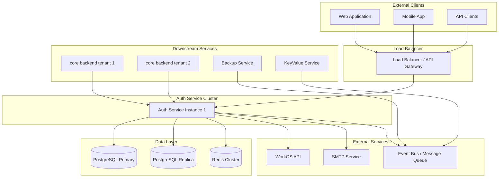

# Central Authentication Service - Architecture Specification

## Executive Summary

A centralized authentication microservice that serves as the single source of truth for identity and access management across all multiple backends. The service enforces single tenant isolation, supports multiple authentication methods, and provides consistent security policies while integrating with external / internal systems through event-driven patterns.

A user can be part of multiple tenants with one account or one tenant with multiple accounts with same or different authentication methods.

By default, a user is member of one tenant and one authentication method.

## System Architecture

Golang requirements:
- Echo v4
- sqlc : https://github.com/sqlc-dev/sqlc
- goose : https://github.com/pressly/goose
- godotenv : https://github.com/joho/godotenv
- air: https://github.com/air-verse/air

```
├── cmd
│   ├── api
│   └── migration
├── go.mod
├── internal
├── migrations
```

### High-Level Components



### Service Boundaries

**Authentication Service Responsibilities:**
- User identity management and storage
- Authentication flow orchestration
- Token lifecycle management
- Tenant isolation enforcement
- Security policy application
- Audit event generation

**Out of Scope:**
- Authorization policies (delegated to individual backends)
- User profile management beyond authentication
- Business logic specific to individual backends

## API Contract Specification

### Authentication Endpoints

#### POST /auth/password/register
Register new user account within tenant boundary.

**Request:**
```json
{
  "email": "user@company.com",
  "password": "SecurePass123!",
  "first_name": "John",
  "last_name": "Doe",
  "tenant_id": "uuid-tenant-123"
}
```

**Response (201):**
```json
{
  "user": {
    "id": "uuid-user-456",
    "email": "user@company.com",
    "first_name": "John",
    "last_name": "Doe",
    "tenant_id": "uuid-tenant-123",
    "mfa_enabled": false,
    "email_verified": false,
    "created_at": "2025-01-15T10:30:00Z"
  },
  "access_token": "eyJhbGciOiJIUzI1NiIs...",
  "refresh_token": "rt_abc123...",
  "expires_in": 900,
  "token_type": "Bearer"
}
```

**Error Responses:**
- `400`: Invalid input data, password policy violation
- `409`: Email already exists within tenant
- `422`: Tenant not found or inactive

#### POST /auth/password/verify
Verify user email.

**Request:**
```json
{
    "token": "abc123...",
    "tenant_id": "uuid-tenant-123"
}
```

**Response (200):**
```json
{
  "user": {
    "id": "uuid-user-456",
    "email": "user@company.com",
    "first_name": "John",
    "last_name": "Doe",
    "tenant_id": "uuid-tenant-123",
    "mfa_enabled": false,
    "email_verified": true,
    "created_at": "2025-01-15T10:30:00Z"
  }
}
```

**Error Responses:**
- `400`: Invalid input data
- `404`: User not found
- `422`: Tenant not found or inactive

#### POST /auth/password/login
Authenticate user with email/password credentials.

**Request:**
```json
{
  "email": "user@company.com",
  "password": "SecurePass123!",
  "tenant_id": "uuid-tenant-123",
  "mfa_code": "123456"
}
```

**Response (200):** Same as register response

**MFA Required Response (202):**
```json
{
  "mfa_required": true,
  "mfa_token": "temp_token_abc123",
  "message": "MFA verification required"
}
```

#### POST /auth/magic-link
Initiate passwordless authentication flow.

**Request:**
```json
{
  "email": "user@company.com",
  "tenant_id": "uuid-tenant-123",
  "redirect_url": "https://app.company.com/dashboard"
}
```

**Response (202):**
```json
{
  "message": "Magic link sent to email",
  "expires_in": 300
}
```

#### GET /auth/magic-link/verify
Verify magic link token and complete authentication.

**Query Parameters:**
- `token`: Magic link token
- `redirect_url`: Optional post-auth redirect

**Response (200):** Authentication response with tokens

#### POST /auth/mfa/enable
Enable MFA for authenticated user.

**Headers:** `Authorization: Bearer {access_token}`

**Response (200):**
```json
{
  "qr_code": "data:image/png;base64,iVBORw0KGgoAAAA...",
  "secret": "JBSWY3DPEHPK3PXP",
  "backup_codes": ["12345678", "87654321", "..."],
  "instructions": "Scan QR code with authenticator app"
}
```

#### POST /auth/mfa/verify
Complete MFA setup or verify MFA during login.

**Request:**
```json
{
  "code": "123456",
  "mfa_token": "temp_token_abc123"
}
```

**Response (200):** Authentication response with tokens

### SSO Integration Endpoints

#### GET /auth/sso/{provider}/initiate
Initiate SSO authentication flow.

**Path Parameters:**
- `provider`: SSO provider (google, microsoft, okta, etc.)

**Query Parameters:**
- `tenant_id`: Target tenant UUID
- `redirect_url`: Post-auth redirect URL
- `state`: Optional state parameter

**Response (302):** Redirect to SSO provider
```json
{
  "authorization_url": "https://sso.provider.com/auth?...",
  "state": "encrypted_state_token"
}
```

#### POST /auth/sso/callback
Handle SSO provider callback and complete authentication.

**Request:**
```json
{
  "code": "auth_code_from_provider",
  "state": "encrypted_state_token"
}
```

**Response (200):** Authentication response with tokens

### Token Management Endpoints

#### POST /auth/refresh
Refresh access token using refresh token.

**Request:**
```json
{
  "refresh_token": "rt_abc123..."
}
```

**Response (200):** New token pair

#### POST /auth/introspect
Validate token and return claims (for backend services).

**Request:**
```json
{
  "token": "eyJhbGciOiJIUzI1NiIs..."
}
```

**Response (200):**
```json
{
  "active": true,
  "user_id": "uuid-user-456",
  "tenant_id": "uuid-tenant-123",
  "email": "user@company.com",
  "roles": ["admin", "user"],
  "mfa_verified": true,
  "email_verified": true,
  "exp": 1642678800,
  "iat": 1642678200
}
```

#### POST /auth/revoke
Revoke token (logout).

**Request:**
```json
{
  "token": "eyJhbGciOiJIUzI1NiIs...",
  "token_type": "access_token"
}
```

**Response (204):** No content

### User Management Endpoints

#### GET /auth/me
Get current authenticated user profile.

**Headers:** `Authorization: Bearer {access_token}`

**Response (200):**
```json
{
  "id": "uuid-user-456",
  "email": "user@company.com",
  "first_name": "John",
  "last_name": "Doe",
  "tenant_id": "uuid-tenant-123",
  "roles": ["admin"],
  "mfa_enabled": true,
  "email_verified": true,
  "last_login_at": "2025-01-15T10:30:00Z"
}
```

## Data Architecture

### Primary Data Stores

**PostgreSQL (Primary):**
- User accounts and profiles
- Tenant configuration
- SSO provider mappings
- Audit logs and security events
- Session metadata

**Redis Cluster:**
- Token blacklist (revoked tokens)
- Rate limiting counters
- Temporary secrets (magic links, MFA setup)
- Session cache for performance

### Data Models

#### User Entity
```json
{
  "id": "uuid", # required
  "tenant_id": "uuid", <-- Many to Many
  "email": "string", # required
  "password_hash": "string", # required only for password authentication
  "first_name": "string", # optional 
  "last_name": "string", # optional
  "is_active": "boolean", # default false
  "email_verified": "boolean", # default false
  "mfa_enabled": "boolean", # default false
  "mfa_secret": "encrypted_string", # optional
  "roles": ["string"], # optional
  "created_at": "timestamp", # default now()
  "updated_at": "timestamp", # default now()
  "last_login_at": "timestamp" # default null
}
```

#### Tenant Entity
```json
{
  "id": "uuid", # required
  "name": "string", # required
  "domain": ["string"], # required
  "is_active": "boolean", # default false
  "settings": {
    "password_policy": {
      "min_length": 8,
      "require_uppercase": true,
      "require_numbers": true,
      "require_symbols": true
    },
    "session_timeout_minutes": 480,
    "mfa_required": false,
    "allowed_domains": ["string"],
    "sso_enabled": true, # default false
    "social_login_enabled": true, # default false
    "social_login_providers": ["string"], # default []
  },
  "created_at": "timestamp", # default now()
  "updated_at": "timestamp", # default now()
}
```

#### Token Claims Structure
```json
{
  "sub": "user_id",
  "tenant_id": "uuid",
  "email": "string",
  "roles": ["string"],
  "mfa_verified": "boolean",
  "email_verified": "boolean",
  "iss": "auth-service",
  "aud": ["hipe-backends"],
  "exp": "timestamp",
  "iat": "timestamp",
  "jti": "token_id"
}
```

## Security Architecture

### Authentication Flows

**Password-Based Flow:**
1. Client sends credentials to `/auth/login`
2. Service validates password against hash
3. If MFA enabled → return MFA challenge
4. On successful auth → issue token pair
5. Publish authentication event

**Magic Link Flow:**
1. Client requests magic link via `/auth/magic-link`
2. Service generates secure token, stores in Redis (5min TTL)
3. Email sent with verification link
4. User clicks link → token verified → authentication complete

**SSO Flow:**
1. Client initiates SSO via `/auth/sso/{provider}/initiate`
2. Service redirects to WorkOS authorization URL
3. User authenticates with identity provider
4. Provider redirects to `/auth/sso/callback`
5. Service exchanges code for user profile
6. User created/updated in local database
7. Authentication tokens issued

### Token Strategy

**Access Tokens:**
- Short-lived JWT (5 minutes) --> config per tenant
- Contains user claims and tenant context
- Signed with HS256 algorithm
- Self-contained for stateless validation

**Refresh Tokens:**
- Long-lived opaque tokens (24 hours) --> config per tenant
- Stored securely in database
- One-time use with rotation
- Revocable for immediate logout

**Token Revocation:**
- Blacklist approach using Redis
- Store revoked token JTIs until expiry
- Backends check blacklist during validation

### Security Controls

**Rate Limiting:**
- Authentication endpoints: 10 requests/minute per IP
- Token refresh: 5 requests/minute per user
- Password reset: 3 requests/hour per email

**Tenant Isolation:**
- All operations scoped to tenant_id
- Database queries include tenant filters
- Token claims enforce tenant boundaries

**Password Security:**
- Argon2id hashing algorithm
- Configurable complexity requirements
- Breach detection integration

## Integration Architecture

### Event Publishing

Authentication service publishes domain events to message queue for downstream consumption:

#### User Lifecycle Events
```json
{
  "event_type": "user.created|updated|deactivated",
  "tenant_id": "uuid",
  "user_id": "uuid",
  "email": "string",
  "roles": ["string"],
  "timestamp": "iso8601",
  "metadata": {}
}
```

#### Authentication Events
```json
{
  "event_type": "auth.login|logout|mfa_enabled|password_changed",
  "tenant_id": "uuid",
  "user_id": "uuid", 
  "ip_address": "string",
  "user_agent": "string",
  "success": "boolean",
  "timestamp": "iso8601",
  "metadata": {
    "provider": "local|sso",
    "mfa_method": "totp"
  }
}
```

### Backend Service Integration

HIPE backends integrate via token introspection pattern:

1. Backend receives request with `Authorization: Bearer {token}`
2. Backend calls `/auth/introspect` with token
3. Auth service validates and returns claims
4. Backend proceeds with tenant-scoped operations

**Optimization:** Backends can cache token validation results using JWT expiry timestamps and implement local signature verification for reduced latency.

## Operational Architecture

### Deployment Strategy

**Container Orchestration:**
- Kubernetes deployment with 3+ replicas
- Rolling updates for zero-downtime deployments
- Horizontal Pod Autoscaler based on CPU/memory
- Pod Disruption Budget for availability

### Monitoring & Observability

**Health Checks:**
- `GET /health` - Basic service health
- `GET /health/ready` - Readiness probe (database connectivity)
- `GET /health/live` - Liveness probe (database connectivity)
- `GET /metrics` - Prometheus metrics endpoint

**Key Metrics:**
- Authentication success/failure rates
- Token validation latency (p95, p99)
- Active session count
- MFA adoption rates
- SSO provider response times

**Alerting Conditions:**
- Authentication failure spike (>10% in 5min)
- Database connection pool exhaustion
- Redis cluster node failures
- SSO provider timeouts

### Configuration Management

**Environment Variables:**
```
DATABASE_URL=postgresql://...
REDIS_URL=redis://...
JWT_SECRET_KEY=base64_encoded_key
WORKOS_API_KEY=workos_key
WORKOS_CLIENT_ID=client_id
SMTP_HOST=smtp.service.com
LOG_LEVEL=info
ENVIRONMENT=production
```

**Secret Management:**
- Kubernetes secrets for sensitive values
- Encryption at rest for database

## Performance Requirements

**Latency Targets:**
- Authentication: <500ms (95th percentile)
- Token validation: <100ms (95th percentile)
- Health checks: <50ms

**Throughput Targets:**
- 1000 authentications/second
- 10,000 token validations/second
- 100 concurrent SSO flows

**Availability Targets:**
- 99.9% uptime SLA
- <30s recovery time for planned maintenance
- Multi-region deployment capability

## Implementation Roadmap

### Phase 1: Core Authentication (Week 1-2)
- Basic Echo server with middleware
- PostgreSQL integration and migrations  
- JWT token management
- Email/password authentication
- Strong tenant isolation
- Health checks and metrics

### Phase 2: Advanced Features (Week 2-3)
- Magic link authentication
- MFA implementation (TOTP)
- WorkOS SSO integration
- Token introspection endpoint
- Event publishing system
- Rate limiting and security controls

### Phase 3: Production Readiness (Week 3-4)
- Comprehensive test coverage
- Performance optimization
- Security hardening and audit
- Monitoring and alerting setup
- Documentation and runbooks
- Load testing and capacity planning